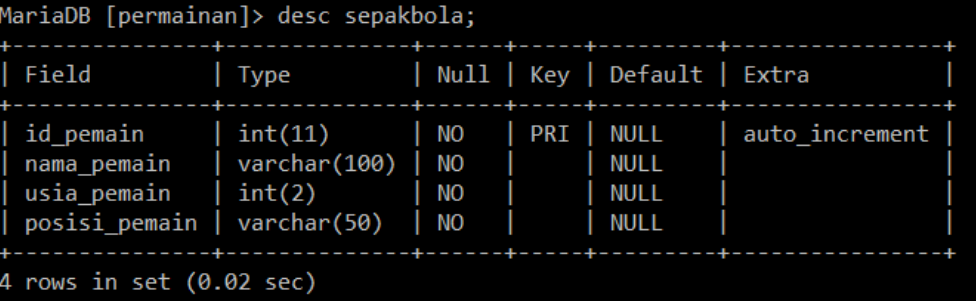

# Tugas 4 Database

### 1. Buatlah database permainan
```mysql
CREATE DATABASE permainan;
```

### 2. Buatlah table sepakbola
```mysql
CREATE TABLE sepakbola;
```

### 3. Buatlah struktur table sepakbola sebagai berikut:

<p align="center"></div></p>

```mysql
CREATE TABLE sepakbola (id_pemain INT NOT NULL PRIMARY KEY AUTO_INCREMENT, nama_pemain VARCHAR(100), usia_pemain INT(2), posisi_pemain VARCHAR(50));
```

### 4. Ubah nama tabel menjadi sepakbola_indonesia
```mysql
ALTER TABLE sepakbola RENAME TO sepakbola_indonesia;
```
atau
```mysql
RENAME TABLE sepakbola TO sepakbola_indonesia;
```

### 5. Hapus table sepakbola_indonesia dan database permainan
```mysql
DROP TABLE sepakbola_indonesia;
```
